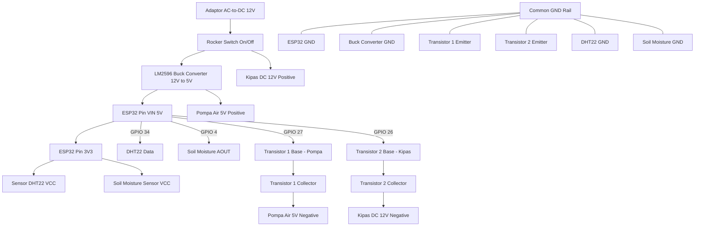

# 🔌 Skematik & Wiring Diagram Smart Greenhouse (REVISI)

Dokumen ini berisi spesifikasi pengkabelan terbaru (**Schematic Revisi**), pemetaan pin GPIO ESP32, penggunaan penggerak transistor BJT, dan sistem modul konverter daya.

---

## ⚡ Sistem Distribusi Daya & Konversi Tegangan (Revisi)

Sistem menggunakan catu daya utama **12V DC Adapter** dengan modul konversi tegangan efisien:

1. **Catu Daya Utama:** Adaptor AC to DC 12V.
2. **Saklar Utama (Rocker Switch):** Dipasang secara seri pada jalur VCC 12V positif utama sebagai saklar On/Off seluruh sistem.
3. **LM2596 Buck Converter (Step-Down Module):**
   * Mengubah tegangan masukan **12V DC** menjadi **5V DC**.
   * Tegangan 5V digunakan untuk memberi daya pada **ESP32 (Pin VIN)** dan **Pompa Air Mini 5V**.
4. **Tegangan 3.3V (ESP32 Internal Regulator):**
   * Diambil dari pin **3V3** ESP32 untuk memberi daya pada sensor **DHT22** dan **Capacitive Soil Moisture Sensor v1.2**.
5. **Catu Daya 12V Langsung:** Tegangan 12V dihubungkan langsung ke **Kipas DC 12V** (dikontrol melalui Transistor).
6. **Common Ground (GND):** Seluruh ground (GND) dari adaptor, buck converter, ESP32, sensor, dan sirkuit transistor terhubung secara bersamaan (*common ground*).

---

## ⚙️ Driver Aktuator Transistor (Pengganti Relay)

Pada skematik revisi ini, penggerak aktuator menggunakan **Transistor NPN (BC547 / setara)** yang dilengkapi dengan **Resistor Basis** dan **Diode Proteksi Flyback**:

* **Driver Pompa Air (5V):**
  * Dikendalikan oleh ESP32 **GPIO 27** melalui Resistor ke Basis (B).
  * Collector (C) terhubung ke beban Pompa 5V dengan dioda proteksi.
  * Emitter (E) terhubung ke Common GND.
* **Driver Kipas DC (12V):**
  * Dikendalikan oleh ESP32 **GPIO 26** melalui Resistor ke Basis (B).
  * Collector (C) terhubung ke beban Kipas 12V dengan dioda proteksi.
  * Emitter (E) terhubung ke Common GND.

---

## 📌 Pemetaan Pin GPIO ESP32 (Schematic Revisi)

| Komponen Perangkat | Jenis / Fungsi | Pin Perangkat | Pin ESP32 | Keterangan |
| :--- | :--- | :--- | :--- | :--- |
| **DHT22** | Sensor Suhu & Kelembaban | Data | **GPIO 34** | Digital Input |
| **Soil Moisture v1.2** | Sensor Kelembaban Tanah | Analog Out (AOUT) | **GPIO 4** | Analog Input (ADC) |
| **Driver Transistor 1** | Aktuator (Pompa Air 5V) | Base (B) via Resistor | **GPIO 27** | Digital Output |
| **Driver Transistor 2** | Aktuator (Kipas DC 12V) | Base (B) via Resistor | **GPIO 26** | Digital Output |

---

## 🔌 Detail Pengkabelan (Wiring Connections Revisi)

### 1. Sensor
* **Sensor Suhu DHT22:**
  * VCC ➡️ Pin ESP32 **3V3**
  * GND ➡️ Common GND
  * DATA ➡️ ESP32 **GPIO 34** (Kabel Hijau)

* **Sensor Kelembaban Tanah (Capacitive Soil Moisture v1.2):**
  * VCC ➡️ Pin ESP32 **3V3**
  * GND ➡️ Common GND
  * AOUT ➡️ ESP32 **GPIO 4** (Kabel Kuning)

### 2. Aktuator & Driver Transistor
* **Pompa Air Mini 5V:**
  * VCC (+) ➡️ Jalur **5V** Buck Converter
  * GND (-) ➡️ Collector (C) Transistor 1
  * Basis (B) Transistor 1 ➡️ Resistor ➡️ ESP32 **GPIO 27** (Kabel Ungu)
  * Emitter (E) Transistor 1 ➡️ Common GND

* **Kipas DC 12V:**
  * VCC (+) ➡️ Jalur **12V** Adaptor
  * GND (-) ➡️ Collector (C) Transistor 2
  * Basis (B) Transistor 2 ➡️ Resistor ➡️ ESP32 **GPIO 26**
  * Emitter (E) Transistor 2 ➡️ Common GND

---

## 📐 Diagram Alur Daya & Kontrol (Mermaid)

