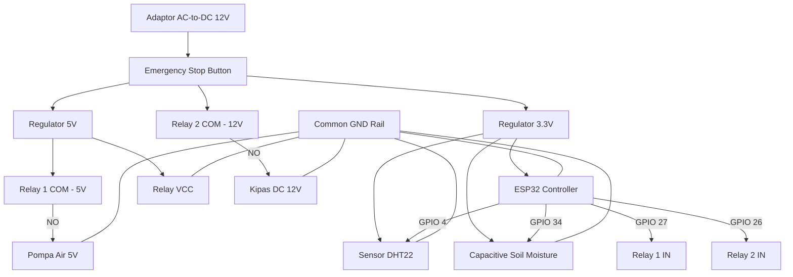

# 🔌 Skematik & Wiring Diagram Smart Greenhouse

Dokumen ini berisi spesifikasi pengkabelan (*wiring diagram*), pemetaan pin GPIO ESP32, serta sistem distribusi daya untuk proyek Smart Greenhouse berbasis Cyber-Physical System (CPS).

---

## ⚡ Sistem Distribusi Daya & Keamanan

Sistem menggunakan **Dual Voltage Supply (12V & 5V & 3.3V)** dengan proteksi keselamatan fisik:

1. **Catu Daya Utama:** Adaptor AC to DC 12V.
2. **Emergency Stop Button:** Dipasang secara seri pada jalur utama VCC 12V tepat setelah adaptor. Menekan tombol ini akan memutus seluruh aliran listrik ke sistem secara instan untuk keamanan darurat.
3. **Regulator Tegangan:**
   * **Regulator 5V (e.g. LM7805):** Mengubah tegangan 12V menjadi 5V untuk memberikan daya pada Pompa Air Mini 5V dan Modul Relay.
   * **Regulator 3.3V (e.g. LM1117-3.3):** Mengubah tegangan 12V menjadi 3.3V untuk memberikan daya ke mikrokontroler ESP32, Sensor DHT22, dan Sensor Kelembaban Tanah.
4. **Common Ground (GND):** Seluruh ground (GND) dari adaptor, ESP32, regulator, sensor, dan aktuator terhubung secara bersamaan (*common ground*).

---

## 📌 Pemetaan Pin GPIO ESP32

| Komponen | Jenis Component | Pin Perangkat | Pin ESP32 | Keterangan |
| :--- | :--- | :--- | :--- | :--- |
| **DHT22** | Sensor Suhu & Kelembaban | Data | **GPIO 4** | Digital Input |
| **Soil Moisture v1.2** | Sensor Kelembaban Tanah | Analog Out (AOUT) | **GPIO 34** | Analog Input (ADC) |
| **Relay Channel 1** | Aktuator (Pompa Air 5V) | IN1 | **GPIO 27** | Digital Output |
| **Relay Channel 2** | Aktuator (Kipas DC 12V) | IN2 | **GPIO 26** | Digital Output |

---

## 🔌 Detail Pengkabelan (Wiring Connections)

### 1. Sensor
* **Sensor Suhu DHT22:**
  * VCC ➡️ Jalur 3.3V
  * GND ➡️ Common GND
  * DATA ➡️ ESP32 **GPIO 4**

* **Sensor Kelembaban Tanah (Capacitive Soil Moisture v1.2):**
  * VCC ➡️ Jalur 3.3V
  * GND ➡️ Common GND
  * AOUT ➡️ ESP32 **GPIO 34**

### 2. Modul Relay (Dual Channel)
* VCC ➡️ Jalur 5V / 12V (Sesuai spesifikasi modul relay)
* GND ➡️ Common GND
* IN1 ➡️ ESP32 **GPIO 27** (Mengendalikan Pompa)
* IN2 ➡️ ESP32 **GPIO 26** (Mengendalikan Kipas)

### 3. Aktuator
* **Pompa Air Mini 5V:**
  * VCC (+) ➡️ Relay 1 (COM ke Jalur 5V, NO ke (+) Pompa)
  * GND (-) ➡️ Common GND
* **Kipas DC 12V:**
  * VCC (+) ➡️ Relay 2 (COM ke Jalur 12V, NO ke (+) Kipas)
  * GND (-) ➡️ Common GND

---

## 📐 Diagram Blok Rangkaian (Mermaid)

