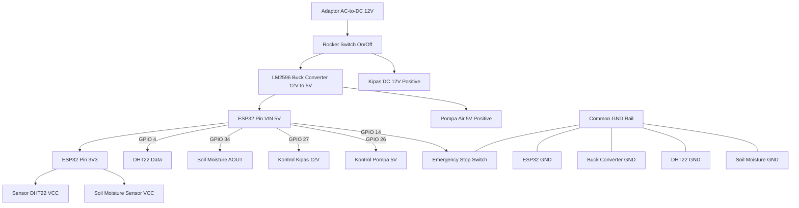

# 🔌 Skematik & Wiring Diagram Smart Greenhouse (FINAL FIRMWARE)

Dokumen ini berisi spesifikasi pengkabelan terbaru yang telah disinkronkan dengan **Firmware Final (Harits)**, pemetaan pin GPIO ESP32, penggunaan penggerak aktuator, proteksi Emergency Stop Switch, dan sistem modul konverter daya.

---

## ⚡ Sistem Distribusi Daya & Konversi Tegangan

Sistem menggunakan catu daya utama **12V DC Adapter** dengan modul konversi daya efisien:

1. **Catu Daya Utama:** Adaptor AC to DC 12V.
2. **Saklar Utama & E-Stop:** 
   * **Rocker Switch Utama:** Dipasang secara seri pada jalur VCC 12V positif utama.
   * **Emergency Stop Switch Fisik:** Terhubung ke **GPIO 14** (mode `INPUT_PULLUP`) dengan interupsi perangkat keras (*hardware interrupt*) untuk mengunci sistem dan mematikan seluruh aktuator seketika saat ditekan.
3. **LM2596 Buck Converter (Step-Down Module):**
   * Mengubah tegangan masukan **12V DC** menjadi **5V DC**.
   * Tegangan 5V digunakan untuk memberi daya pada **ESP32 (Pin VIN)**, **Pompa Air Mini 5V**, dan **Modul Relay/Driver**.
4. **Tegangan 3.3V (ESP32 Internal Regulator):**
   * Diambil dari pin **3V3** ESP32 untuk memberi daya pada sensor **DHT22** dan **Capacitive Soil Moisture Sensor v1.2**.
5. **Catu Daya 12V Langsung:** Tegangan 12V dihubungkan langsung ke **Kipas DC 12V** (dikontrol melalui Relay/Driver).
6. **Common Ground (GND):** Seluruh ground (GND) dari adaptor, buck converter, ESP32, sensor, saklar, dan aktuator terhubung secara bersamaan (*common ground*).

---

## 📌 Pemetaan Pin GPIO ESP32 (Sinkronisasi Firmware Final)

| Komponen Perangkat | Jenis / Fungsi | Pin Perangkat | Pin ESP32 | Keterangan Mode |
| :--- | :--- | :--- | :--- | :--- |
| **DHT22** | Sensor Suhu & Kelembaban | Data | **GPIO 4** | Digital Input |
| **Capacitive Soil Moisture v1.2** | Sensor Kelembaban Tanah | Analog Out (AOUT) | **GPIO 34** | Analog Input (ADC1) |
| **Kipas DC 12V** | Aktuator Pendingin | Control / IN | **GPIO 27** | Digital Output |
| **Pompa Air Mini 5V** | Aktuator Irigasi | Control / IN | **GPIO 26** | Digital Output |
| **Emergency Stop Switch** | Saklar Darurat Keamanan | Switch Pin | **GPIO 14** | Digital Input (INPUT_PULLUP Interrupt) |

---

## 🔌 Detail Pengkabelan (Wiring Connections)

### 1. Sensor
* **Sensor Suhu DHT22:**
  * VCC ➡️ Pin ESP32 **3V3**
  * GND ➡️ Common GND
  * DATA ➡️ ESP32 **GPIO 4**

* **Sensor Kelembaban Tanah (Capacitive Soil Moisture v1.2):**
  * VCC ➡️ Pin ESP32 **3V3**
  * GND ➡️ Common GND
  * AOUT ➡️ ESP32 **GPIO 34** (ADC)

### 2. Aktuator & Driver
* **Kipas DC 12V:**
  * Jalur Daya (+) ➡️ Jalur **12V** Adaptor
  * Jalur Kontrol ➡️ ESP32 **GPIO 27**
  * GND (-) ➡️ Common GND

* **Pompa Air Mini 5V:**
  * Jalur Daya (+) ➡️ Jalur **5V** Buck Converter
  * Jalur Kontrol ➡️ ESP32 **GPIO 26**
  * GND (-) ➡️ Common GND

### 3. Keamanan Fisik (Safety Switch)
* **Emergency Stop Switch:**
  * Satu terminal ➡️ ESP32 **GPIO 14**
  * Terminal lainnya ➡️ Common **GND** (Aktif saat LOW / Tertekan)

---

## 📐 Diagram Alur Daya & Kontrol (Mermaid)

